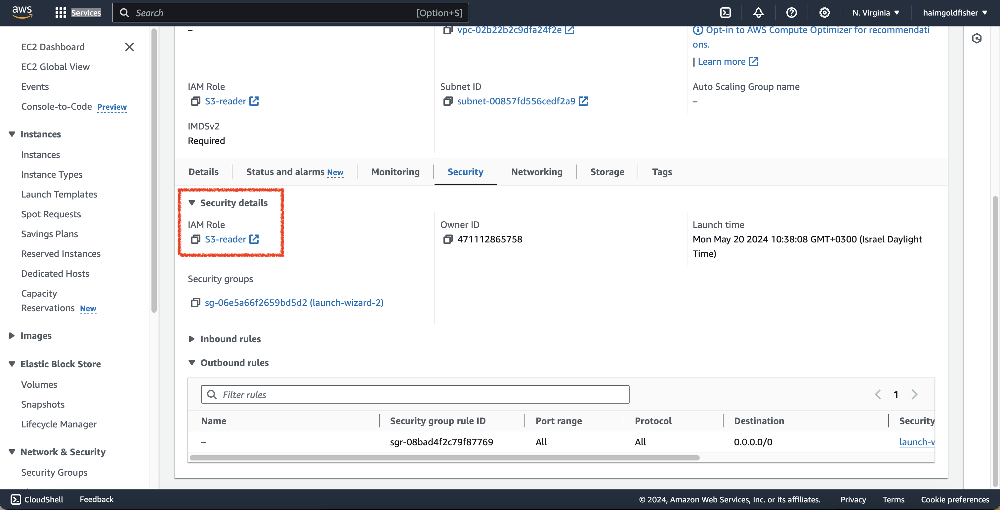

# Flask-SQLite-App with AWS

## Description

This project is a Flask web application that allows users to enter their name and email, which are then stored in an SQLite database. Users can also view the stored names and emails by accessing a specific route.

## Installation Instructions

### Prerequisites

Ensure you have the following installed on your system:
- [Docker](https://www.docker.com/get-started)
- [Docker Compose](https://docs.docker.com/compose/install/)

### Install Requirements
- Install the required Python packages using pip (if running locally):
  ```sh
  pip install -r requirements.txt 
    ```

## Usage Instructions

### 1. Run Flask App
- Execute the Flask application:
- The application will start running on a local server. Access the provided IP address (e.g., http://127.0.0.1:8000/) in a web browser.


### 2. Add Name and Email
- Upon accessing the application, you will see a form where you can enter your name and email.
- Fill in the required fields and click the "Submit" button to add your information to the database.


### 3. View Names and Emails
- To view the stored names and emails, append `/db` to the application URL in the address bar of your browser (e.g., http://127.0.0.1:8000/db).
- This will display a table with the names and emails stored in the database.


## Dockerize
To simplify deployment and ensure consistency across different environments, this application has been containerized using Docker. **Dockerfile** and **docker-compose.yml** were created in the root directory of the project. To build and run the Docker container, use the following command:

```sh
docker-compose up --build
  ```

The application will be accessible at '**http://127.0.0.1:8000/**'.


## AWS Integration

This Flask application assumes that it is running on an EC2 instance within an AWS environment. The application utilizes an Amazon S3 bucket to store images, which are accessed by the Flask app to display content to users. However, the images stored in the S3 bucket are kept private, and access to them is restricted.

To ensure that the Flask application can access the images stored in the S3 bucket, the EC2 instance hosting the application is assigned an IAM role with appropriate permissions. In this case, the role should have the `AmazonS3ReadOnlyAccess` policy attached, allowing the instance to read objects from the specified S3 bucket.

When the Flask application runs on an EC2 instance with the necessary IAM role, it can successfully retrieve and display the images from the S3 bucket. However, if the instance does not have the required permissions or if the IAM role is not properly configured, the application will encounter errors when attempting to access the S3 bucket.

### Auto Scaling Group & Load Balancer

To ensure high availability and scalability of the Flask application, an Auto Scaling Group (ASG) and a Load Balancer were set up:

1. **Launch Template Creation:**
   - Created a launch template based on `t2.micro` instance with Ubuntu.
   - Added user data script to install Docker, clone the GitHub repository, and run the application using Docker Compose:
     ```bash
     #!/bin/bash
     sudo apt update
     sudo snap install docker
     git clone https://github.com/haimgoldfisher/flask-docker-aws.git
     cd flask-docker-aws
     sudo docker-compose up --build -d
     ```

2. **Network Load Balancer (NLB):**
   - Created an NLB to distribute incoming traffic across multiple instances of the application.
   - Configured the NLB with the appropriate security groups (SG) and target groups (TG) to ensure proper routing.

3. **Auto Scaling Group (ASG):**
   - Created an ASG using the launch template and NLB.
   - Set the minimum number of instances to 1 and the maximum to 3 to handle varying loads.

4. **Load Balancer Check:**
   - Verified the setup by using the DNS address provided by the NLB to access the application. The NLB successfully routed requests to the running application instances.

5. **Auto Scaling Group Check:**
   - Tested the ASG by stressing the CPU on an EC2 instance to trigger scaling actions. Observed that the ASG launched a new instance in response to the increased load.


### Screenshots

1. **AWS Console with S3 Bucket:**
   
   The S3 bucket for the application, showing the stored image:
   

2. **Updated Code with S3 Image URL:**

   The updated code snippet showing how the application accesses images from the S3 bucket:
   

3. **App Deployment with EC2:**
   
   The EC2 instance running the Flask application, displaying successful deployment:
   

4. **Updated Code to Get S3 Image URL If Permitted:**
   
   The code logic implemented to retrieve the S3 image URL, handling permissions:
   

5. **EC2 with S3 Reader IAM Role:**

   The EC2 instance with the IAM role that grants read access to the S3 bucket:
   
   

6. **Welcome HTML When EC2 Has No IAM Role:**

   The welcome page shown when the EC2 instance lacks the necessary IAM role, preventing access to the S3 bucket:
   

7. **Launch Template's Bash Script:**
   
   The user data script in the launch template, used to configure the EC2 instance upon startup:
   

8. **Created a Load Balancer:**

   The Load Balancer instance which distributes traffic across multiple EC2 instances:
   

9. **Entered The App Using Auto Scaling Group with Load Balancer DNS:**
   
   The application accessed via the DNS address of the Load Balancer, showcasing the Auto Scaling Group's functionality:
   

10. **Stressed the CPU of EC2 in Order to Trigger Auto Scaling:**
   
   The EC2 instance under CPU stress, used to trigger the Auto Scaling Group to launch additional instances:
   

11. **Auto Scaling Group Reaction to CPU Stress:**
   
   The Auto Scaling Group's response to the increased CPU load, automatically launching a new instance:
   

   

## Project Architecture

This project follows a client-server architecture using Flask as the web framework, HTML for front-end rendering, and SQLite for database management. The project directory structure is as follows:
 
```
flask-docker-aws/
│
├── app/
│   ├── flask-app.py        # Flask app file
│   ├── templates/          # HTML templates dir
│   │   ├── db.html         # Template for displaying names and emails
│   │   ├── index.html      # Template for entering name and email
│   │   └── welcome.html    # Template for welcoming user
├── instance/
│   └── users.db            # SQLite db
├── .venv/                  # Virtual env. directory (if running locally)
├── requirements.txt        # File for dependencies
├── Dockerfile              # Dockerfile for containerizing the app
└── docker-compose.yml      # Docker Compose file for defining services
```

The Flask application (`flask-app.py`) handles routing and interactions with the database. HTML templates (`templates/`) are used for rendering front-end views. SQLite is used to store user information in the database.

## Author

[Haim Goldfisher](https://github.com/haimgoldfisher)

## License

This project is licensed under the [MIT License](LICENSE).
