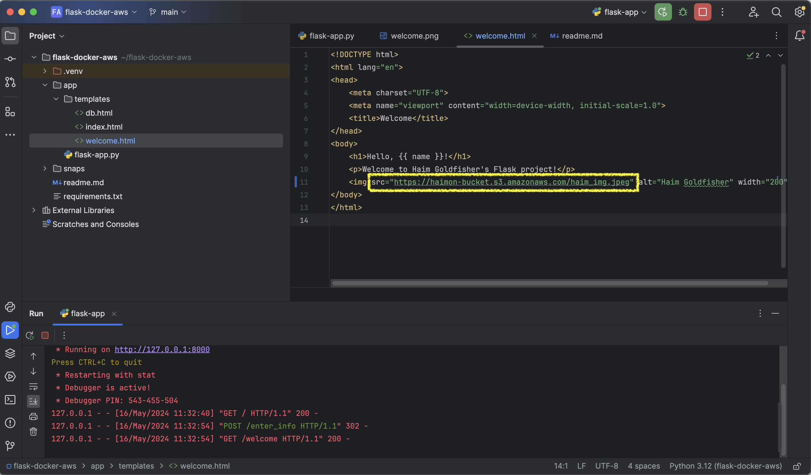

# Flask-Postgres-App

## Description

This project is a Flask web application that allows users to enter their name and email, which are then stored in a PostgreSQL database. Users can also view the stored names and emails by accessing a specific route.

## Installation Instructions

### 1. Install PostgreSQL
- **Mac:**
  - Install PostgreSQL using Homebrew:
    ```
    brew install postgresql
    ```
  - Start PostgreSQL service:
    ```
    brew services start postgresql
    ```
  - Create a database and user:
    ```
    psql
    CREATE DATABASE mydatabase;
    CREATE USER myuser WITH PASSWORD 'mypassword';
    ALTER ROLE myuser SET client_encoding TO 'utf8';
    ALTER ROLE myuser SET default_transaction_isolation TO 'read committed';
    ALTER ROLE myuser SET timezone TO 'UTC';
    GRANT ALL PRIVILEGES ON DATABASE mydatabase TO myuser;
    ```
- **Windows:**
  - Download and install PostgreSQL from the official website: [PostgreSQL Downloads](https://www.postgresql.org/download/windows/)
  - During installation, create a database and user with the desired credentials.

### 2. Install Requirements
- Install the required Python packages using pip:
  ```
  pip install -r requirements.txt 
    ```

## Usage Instructions

### 1. Run Flask App
- Execute the Flask application:
- The application will start running on a local server. Access the provided IP address (e.g., http://127.0.0.1:8000/) in a web browser.


### 2. Add Name and Email
- Upon accessing the application, you will see a form where you can enter your name and email.
- Fill in the required fields and click the "Submit" button to add your information to the database.


### 3. View Names and Emails
- To view the stored names and emails, append `/db` to the application URL in the address bar of your browser (e.g., http://127.0.0.1:8000/db).
- This will display a table with the names and emails stored in the database.


## Amazon S3 Integration

To integrate Amazon S3 into the project, the following steps were taken:

1. **Created S3 Bucket with Public Read Access:**
   - A new S3 bucket was created using the AWS Management Console.
   - Public read access was granted to the bucket to allow access to the uploaded image.

2. **Uploaded Image to S3 Bucket:**
   - An image was uploaded to the newly created S3 bucket.

3. **Made the Image Public:**
   - The uploaded image in the S3 bucket was made public to allow access from external sources.

4. **Updated Image URL in welcome.html:**
   - The URL of the image in the `welcome.html` file was updated to point to the public URL of the image hosted on S3.

### Screenshots

1. **AWS Console with S3 Bucket:**
   - 

2. **Updated Code with S3 Image URL:**
   - 

By following these steps, Amazon S3 integration was successfully implemented, allowing the project to utilize an image hosted on S3.


## Project Architecture

This project follows a client-server architecture using Flask as the web framework, HTML for front-end rendering, and PostgreSQL for database management. The project directory structure is as follows:
 
```
flask-docker-aws/
│
├── app/
│   ├── flask-app.py        # Flask app file
│   ├── templates/          # HTML templates directory
│   │   ├── db.html         # Template for displaying names and emails
│   │   ├── index.html      # Template for entering name and email
│   │   └── welcome.html    # Template for welcoming user
├── .venv/                   # Virtual env. directory
├── requirements.txt         # File for dependencies
```


The Flask application (`flask-app.py`) handles routing and interactions with the database. HTML templates (`templates/`) are used for rendering front-end views. PostgreSQL is used to store user information in the database.

## Author

[Haim Goldfisher](https://github.com/haimgoldfisher)

## License

This project is licensed under the [MIT License](LICENSE).
